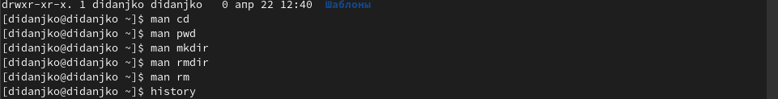

---
## Front matter
title: "Отчёт по лабораторной № 4"
subtitle: "НПМбд-01-21"
author: "Дмитрий Игоревич Данько"

## Generic otions
lang: ru-RU
toc-title: "Содержание"

## Bibliography
bibliography: bib/cite.bib
csl: pandoc/csl/gost-r-7-0-5-2008-numeric.csl

## Pdf output format
toc: true # Table of contents
toc-depth: 2
lof: true # List of figures
lot: true # List of tables
fontsize: 12pt
linestretch: 1.5
papersize: a4
documentclass: scrreprt
## I18n polyglossia
polyglossia-lang:
  name: russian
  options:
	- spelling=modern
	- babelshorthands=true
polyglossia-otherlangs:
  name: english
## I18n babel
babel-lang: russian
babel-otherlangs: english
## Fonts
mainfont: PT Serif
romanfont: PT Serif
sansfont: PT Sans
monofont: PT Mono
mainfontoptions: Ligatures=TeX
romanfontoptions: Ligatures=TeX
sansfontoptions: Ligatures=TeX,Scale=MatchLowercase
monofontoptions: Scale=MatchLowercase,Scale=0.9
## Biblatex
biblatex: true
biblio-style: "gost-numeric"
biblatexoptions:
  - parentracker=true
  - backend=biber
  - hyperref=auto
  - language=auto
  - autolang=other*
  - citestyle=gost-numeric
## Pandoc-crossref LaTeX customization
figureTitle: "Рис."
tableTitle: "Таблица"
listingTitle: "Листинг"
lofTitle: "Список иллюстраций"
lotTitle: "Список таблиц"
lolTitle: "Листинги"
## Misc options
indent: true
header-includes:
  - \usepackage{indentfirst}
  - \usepackage{float} # keep figures where there are in the text
  - \floatplacement{figure}{H} # keep figures where there are in the text
---

# Цель работы

Приобретение практических навыков взаимодействия пользователя с системой посредством командной строки.

# Задание

1. Определите полное имя вашего домашнего каталога. Далее относительно этого каталога будут выполняться последующие упражнения.

2. Выполните следующие действия:

2.1. Перейдите в каталог /tmp.

2.2. Выведите на экран содержимое каталога /tmp. Для этого используйте команду ls

с различными опциями. Поясните разницу в выводимой на экран информации.

2.3. Определите, есть ли в каталоге /var/spool подкаталог с именем cron?

2.4. Перейдите в Ваш домашний каталог и выведите на экран его содержимое. Определите, кто является владельцем файлов и подкаталогов?

3. Выполните следующие действия:

3.1. В домашнем каталоге создайте новый каталог с именем newdir.

3.2. В каталоге ~/newdir создайте новый каталог с именем morefun.

3.3. В домашнем каталоге создайте одной командой три новых каталога с именами
letters, memos, misk. Затем удалите эти каталоги одной командой.

3.4. Попробуйте удалить ранее созданный каталог ~/newdir командой rm. Проверьте,
был ли каталог удалён.

3.5. Удалите каталог ~/newdir/morefun из домашнего каталога. Проверьте, был ли
каталог удалён.

4. С помощью команды man определите, какую опцию команды ls нужно использовать для просмотра содержимое не только указанного каталога, но и подкаталогов,входящих в него.

5. С помощью команды man определите набор опций команды ls, позволяющий отсортировать по времени последнего изменения выводимый список содержимого каталога
с развёрнутым описанием файлов.

6. Используйте команду man для просмотра описания следующих команд: cd, pwd, mkdir,
rmdir, rm. Поясните основные опции этих команд.

7. Используя информацию, полученную при помощи команды history, выполните модификацию и исполнение нескольких команд из буфера команд.

# Теоретическое введение

(Сслылка на Github)[https://github.com/DankoDmitry/study_2021-2022_os-intro]

# Выполнение лабораторной работы

## 1

Узнали полное имя каталога. После перешли в каталог /tmp/ и узнали его содержимое (рис. pwd). Зашли в каталог /var/spool и не нашли там файла cron (рис. cron). Перешли в домашний католог и вывели на экран его содержимое (рис. ls).

{ #fig:001 width=70% }

{ #fig:001 width=70% }

{ #fig:001 width=70% }

## 2

Создадим фай newdir, в нём morefun (рис. Сздание). В исходно катологе ещё подкатологи letters, memos, misk. И удалим их (рисю Удаление).

{ #fig:001 width=70% }

{ #fig:001 width=70% }

## 3

Используем man, чтобы определить набор опций команды ls, позволяющий отсортировать по времени последнего изменения выводимый список содержимого каталога с развёрнутым описанием файлов (рис. ls2).

{ #fig:001 width=70% }

## 4

Изучаем команды cd, pwd, mkdir (рис. man) и пользуемся командой history (рис. history).

{ #fig:001 width=70% }

{ #fig:001 width=70% }

# Контрольные вопросы

- Другой интерфейс — это командная строка (CLI — Command Line Interface). Пользователь вводит в неё определённые команды (набор букв, цифр и символов) с помощью клавиатуры, и компьютер запускает соответствующие процессы. Открыть командную строку в Линукс-системах можно через консоль или терминал.
- pwd
- ls
- ls -a
- rm -r ***файл/каталог***
- history
- mkdir letters memos misk
- Экранирование символов — замена в тексте управляющих символов на соответствующие текстовые подстановки.
- Выводить подробный список, в котором будет отображаться владелец, группа, дата создания, размер и другие параметры.
- man/help/info
- *Tab*

# Выводы

Входе выполнения данной работы научились пользоваться командной строкой, а так же познакомились с базовыми командами.

::: {#refs}
:::
