---
## Front matter
title: "Лабораторная работа № 5"
subtitle: "Операционные системы"
author: "Дмитрий Игоревич данько НПМбд-01-21"

## Generic otions
lang: ru-RU
toc-title: "Содержание"

## Bibliography
bibliography: bib/cite.bib
csl: pandoc/csl/gost-r-7-0-5-2008-numeric.csl

## Pdf output format
toc: true # Table of contents
toc-depth: 2
lof: true # List of figures
lot: true # List of tables
fontsize: 12pt
linestretch: 1.5
papersize: a4
documentclass: scrreprt
## I18n polyglossia
polyglossia-lang:
  name: russian
  options:
	- spelling=modern
	- babelshorthands=true
polyglossia-otherlangs:
  name: english
## I18n babel
babel-lang: russian
babel-otherlangs: english
## Fonts
mainfont: PT Serif
romanfont: PT Serif
sansfont: PT Sans
monofont: PT Mono
mainfontoptions: Ligatures=TeX
romanfontoptions: Ligatures=TeX
sansfontoptions: Ligatures=TeX,Scale=MatchLowercase
monofontoptions: Scale=MatchLowercase,Scale=0.9
## Biblatex
biblatex: true
biblio-style: "gost-numeric"
biblatexoptions:
  - parentracker=true
  - backend=biber
  - hyperref=auto
  - language=auto
  - autolang=other*
  - citestyle=gost-numeric
## Pandoc-crossref LaTeX customization
figureTitle: "Рис."
tableTitle: "Таблица"
listingTitle: "Листинг"
lofTitle: "Список иллюстраций"
lotTitle: "Список таблиц"
lolTitle: "Листинги"
## Misc options
indent: true
header-includes:
  - \usepackage{indentfirst}
  - \usepackage{float} # keep figures where there are in the text
  - \floatplacement{figure}{H} # keep figures where there are in the text
---

# Цель работы

	Ознакомление с файловой системой Linux, её структурой, именами и содержанием
каталогов. Приобретение практических навыков по применению команд для работы
с файлами и каталогами, по управлению процессами (и работами), по проверке использования диска и обслуживанию файловой системы.

# Задание

Задание стоит в необходимости отработки методов работы с терминалом, при многократном обращении к последнему.

# Теоретическое введение

[Ссылка на Github](https://github.com/DankoDmitry/study_2021-2022_os-intro)

# Выполнение лабораторной работы

## Пункт 1

Первым делом необходимо выполнить все примеры, что есть в описании лабораторной.

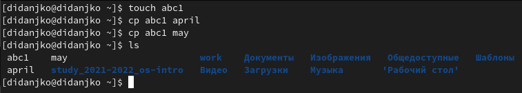

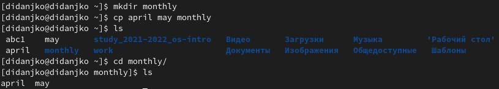

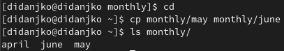

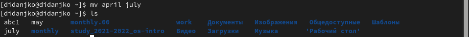

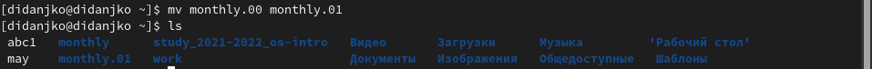

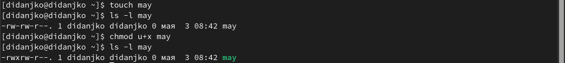

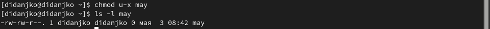

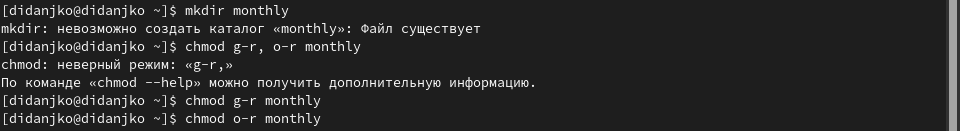

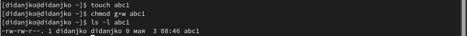

## Пункт 2

2.1. Скопируем файл /usr/include/sys/io.h в домашний каталог и назовём его
equipment.

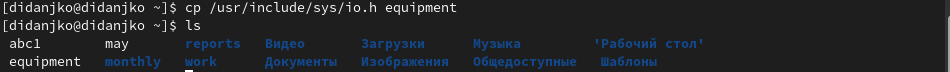

2.2. В домашнем каталоге создадим директорию ~/ski.plases.

2.3. Переместим файл equipment в каталог ~/ski.plases.

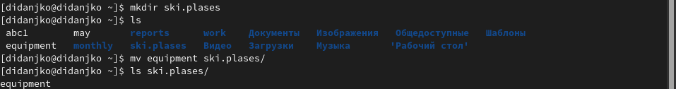

2.4. Переименуем файл ~/ski.plases/equipment в ~/ski.plases/equiplist.

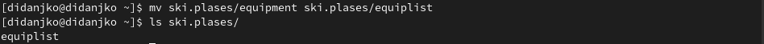

2.5. В домашнем каталоге имеем файл abc1 из примера, скопируем его в каталог
~/ski.plases и назовём equiplist2.

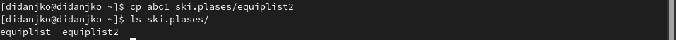

2.6. Создадим каталог с именем equipment в каталоге ~/ski.plases.

2.7. Переместим файлы ~/ski.plases/equiplist и equiplist2 в каталог
~/ski.plases/equipment.

2.8. Создадим и переместим каталог ~/newdir в каталог ~/ski.plases, назовём
его plans.

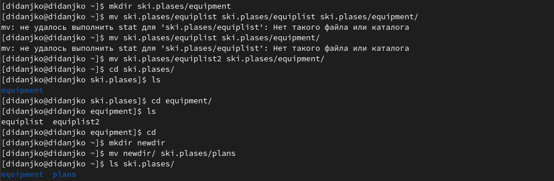

## Пункт 3

Определим опции команды chmod, необходимые для того, чтобы присвоить перечисленным ниже файлам выделенные права доступа, считая, что в начале таких прав нет:

>3.1. drwxr--r-- ... australia 
>3.2. drwx--x--x ... play
>3.3. -r-xr--r-- ... my_os
>3.4. -rw-rw-r-- ... feathers

Заодно создадим данные файлы.

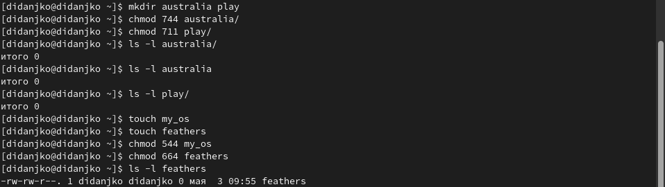

## Пункт 4

Последовательно выполним и объясним следующие пункты:

4.1. Просмотреть содержимое файла /etc/password не сможем, его нет или он скрыт.

4.2. Скопируем файл ~/feathers в файл ~/file.old.

4.3. Переместим файл ~/file.old в каталог ~/play.

4.4. Скопируем каталог ~/play в каталог ~/fun.

4.5. Переместим каталог ~/fun в каталог ~/play и назовите его games.

4.6. Лишим владельца файла ~/feathers права на чтение.

4.7. Если попытаемся просмотреть файл ~/feathers командой cat, то получим отказ из-за отсутствия права доступа.

4.8. Попытавшись скопировать файл ~/feathers так же получим отказ, по той же причине.

4.9. Дадим владельцу файла ~/feathers право на чтение.

4.10. Лишим владельца каталога ~/play права на выполнение.

4.11. Теперь перейти в каталог ~/play не сможем из-за нехватки прав, имеется ввиду, что выполнение каталога
это переход в него, то есть выполнить его мы неможем, а значит и перейти тоже.

4.12. Дадим владельцу каталога ~/play право на выполнение. Теперь можем в него перейти.

Последним прочитаем man по командам mount, fsck, mkfs, kill.

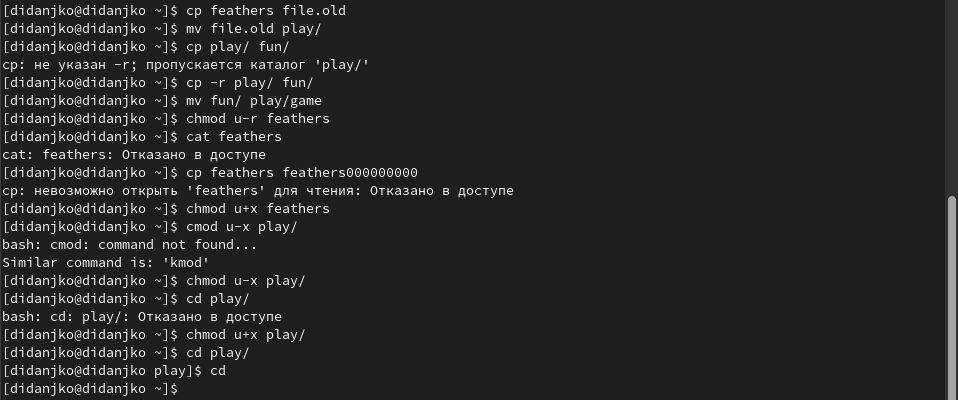

# Команды

> touch abc1  
> cp abc1 april 
> cp abc1 may 
> ls   
> mkdir monthly  
> cp april may monthly
> ls   
> cd monthly/  
> ls   
> cp monthly/may monthly/june 
> cd   
> cp monthly/may monthly/june 
> ls monthly/  
> mkdir monthly.00  
> cp -r monthly monthly.00
> ls monthly.00/  
> cp -r monthly.00 /tmp
> mv april july 
> ls   
> mv july monthly.00 
> ls monthly.00  
> cd monthly.00/monthly/  
> ls   
> cd   
> mv monthly.00 monthly.01 
> ls   
> mkdir reports  
> mv monthly.01 reports 
> ls reports/  
> mv reports/monthly.01 reports/monthly 
> ls reports/  
> touch may  
> ls -l may 
> chmod u+x may 
> ls -l may 
> chmod u-x may 
> ls -l may 
> mkdir monthly  
> chmod g-r, o-r monthly
> chmod g-r monthly 
> chmod o-r monthly 
> chmod g-r o-r monthly
> touch abc1  
> chmod g+w abc1 
> ls -l abc1 
> cd /usr/include/sys/  
> pwd   
> ls   
> cd   
> cp /usr/include/sys/io.h equipment 
> ls     
> mkdir ski.plases  
> ls   
> mv equipment ski.plases/ 
> ls ski.plases/  
> mv /ski.plases/equipment /ski.plases/equipment 
> mv ski.plases/equipment ski.plases/equipment 
> mv ski.plases/equipment ski.plases/equiplist 
> ls ski.plases/  
> cp abc1 ski.plases/equiplist2 
> ls ski.plases/  
> mkdir ski.plases/equipment  
> mv ski.plases/equiplist ski.plases/equiplist ski.plases/equipment/
> mv ski.plases/equiplist ski.plases/equipment/ 
> mv ski.plases/equiplist2 ski.plases/equipment/ 
> cd ski.plases/  
> ls   
> cd equipment/  
> ls   
> cd   
> mkdir newdir  
> mv newdir/ ski.plases/plans 
> ls ski.plases/  
> cd /etc/password  
> mkdir australia play 
> chmod 744 australia/ 
> chmod 711 play/ 
> ls -l australia/ 
> ls -l australia 
> ls -l play/ 
> touch my_os  
> touch feathers  
> chmod 544 my_os 
> chmod 664 feathers 
> ls -l feathers 
> cp feathers file.old 
> mv file.old play/ 
> cp play/ fun/ 
> cp -r play/ fun/
> mv fun/ play/game 
> chmod u-r feathers 
> cat feathers  
> cp feathers feathers000000000 
> chmod u+x feathers 
> cmod u-x play/ 
> chmod u-x play/ 
> cd play/  
> chmod u+x play/ 
> cd play/  
> cd   
> man fsck  
> man mkfs  
> man mount  
> man kill  

# Контрольные вопросы

1. На компьютере используются разные файловые системы, например proc, sysfs, devtmpfs...

2. -

3. -

4. Чаще всего при сохранении, копировании или архивировании/сжатии. Помогает команда fsck

5. Файловая система связывает носитель информации с одной стороны и API для доступа к файлам — с другой. Когда прикладная программа обращается к файлу, она не имеет никакого представления о том, каким образом расположена информация в конкретном файле, так же как и о том, на каком физическом типе носителя он записан.

6. cat - просмотр маленьких файлов. head - предварительный просмотр. more - просмотр больших файлов. tail - просмотр последних строк файла.

7. Перемещение по каталогам системы.

8. Перемещение файлов и каталогов, с возможным переименованием.

9. Некоторое препятствия, присущее файлам и каталогам, ограничивающие возможную работу с ними разным группам лиц. 

# Выводы

В ходе выполнения данной лабораторной работы научились работать с файловыми системами, разобрались в правах доступа.
