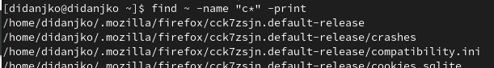
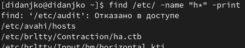
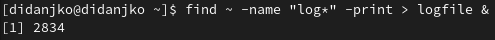
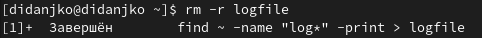
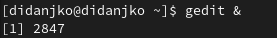
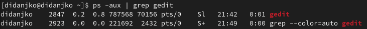
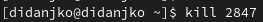
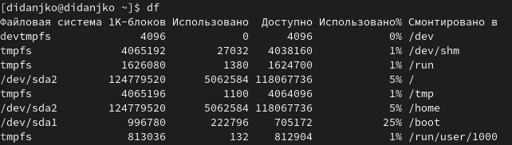
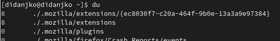
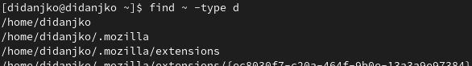

---
## Front matter
title: "Лабораторная работа № 6"
subtitle: "Операционные системы"
author: "Дмитрий Игоревич Данько НПМбд-01-21"

## Generic otions
lang: ru-RU
toc-title: "Содержание"

## Bibliography
bibliography: bib/cite.bib
csl: pandoc/csl/gost-r-7-0-5-2008-numeric.csl

## Pdf output format
toc: true # Table of contents
toc-depth: 2
lof: true # List of figures
lot: true # List of tables
fontsize: 12pt
linestretch: 1.5
papersize: a4
documentclass: scrreprt
## I18n polyglossia
polyglossia-lang:
  name: russian
  options:
	- spelling=modern
	- babelshorthands=true
polyglossia-otherlangs:
  name: english
## I18n babel
babel-lang: russian
babel-otherlangs: english
## Fonts
mainfont: PT Serif
romanfont: PT Serif
sansfont: PT Sans
monofont: PT Mono
mainfontoptions: Ligatures=TeX
romanfontoptions: Ligatures=TeX
sansfontoptions: Ligatures=TeX,Scale=MatchLowercase
monofontoptions: Scale=MatchLowercase,Scale=0.9
## Biblatex
biblatex: true
biblio-style: "gost-numeric"
biblatexoptions:
  - parentracker=true
  - backend=biber
  - hyperref=auto
  - language=auto
  - autolang=other*
  - citestyle=gost-numeric
## Pandoc-crossref LaTeX customization
figureTitle: "Рис."
tableTitle: "Таблица"
listingTitle: "Листинг"
lofTitle: "Список иллюстраций"
lotTitle: "Список таблиц"
lolTitle: "Листинги"
## Misc options
indent: true
header-includes:
  - \usepackage{indentfirst}
  - \usepackage{float} # keep figures where there are in the text
  - \floatplacement{figure}{H} # keep figures where there are in the text
---

# Цель работы

Ознакомление с инструментами поиска файлов и фильтрации текстовых данных.
Приобретение практических навыков: по управлению процессами (и заданиями), по
проверке использования диска и обслуживанию файловых систем.

# Задание

Последовательно выполнить пункты лабораторной работы и ответить на контрольные вопросы.

# Теоретическое введение

Ссылка на [Github](https://github.com/DankoDmitry/study_2021-2022_os-intro)

# Выполнение лабораторной работы

 - Запишем в файл file.txt названия файлов, содержащихся в каталоге /etc и добавим в этот же файл названия файлов, содержащихся в домашнем каталоге. (рис. 1)

 - Выведем имена всех файлов из file.txt, имеющих расширение .conf, после чего
запишем их в новый текстовой файл conf.txt. (рис. 2)

 - Определим, какие файлы в домашнем каталоге имеют имена, начинавшиеся
с символа c? (рис. 3)

 -  Выведем на экран (по странично) имена файлов из каталога /etc, начинающиеся
с символа h. (рис. 4)

 - Запустим в фоновом режиме процесс, который будет записывать в файл ~/logfile
файлы, имена которых начинаются с log. (рис. 5)

 - Удалим файл ~/logfile. (рис. 6)

 - Запустим из консоли в фоновом режиме редактор gedit. (рис. 7)

 - Определим идентификатор процесса gedit, используя команду ps, конвейер и фильтр
grep. (рис. 8)

 - Используем kill для завершения процесса gedit. (рис. 9)

 - Выполним команды df и du.(рис. 10 и рис. 11 соответственно)

 - Воспользовавшись справкой команды find, выведите имена всех директорий, имеющихся в вашем домашнем каталоге.
 За данный вавод отвечает опция -tupe d. (рис. 12)

# Выводы

В ходе выполнения данной лабораторной работы научились управлять процессами, искать и фильтровать файлы и папки.

::: {#refs}
:::
