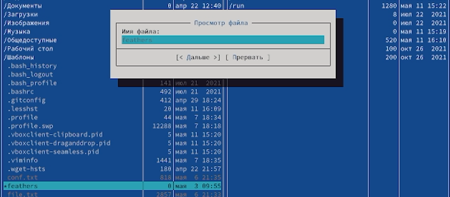
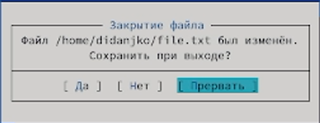
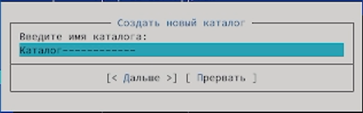
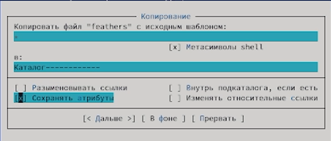
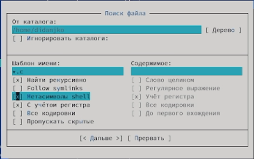
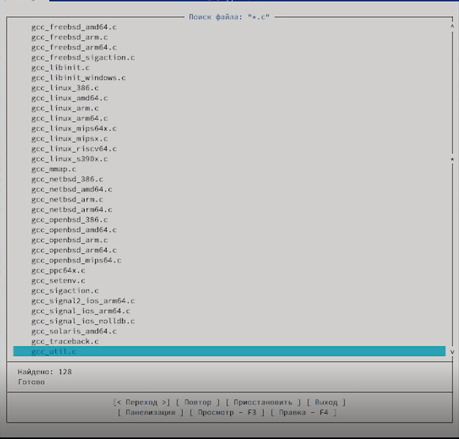
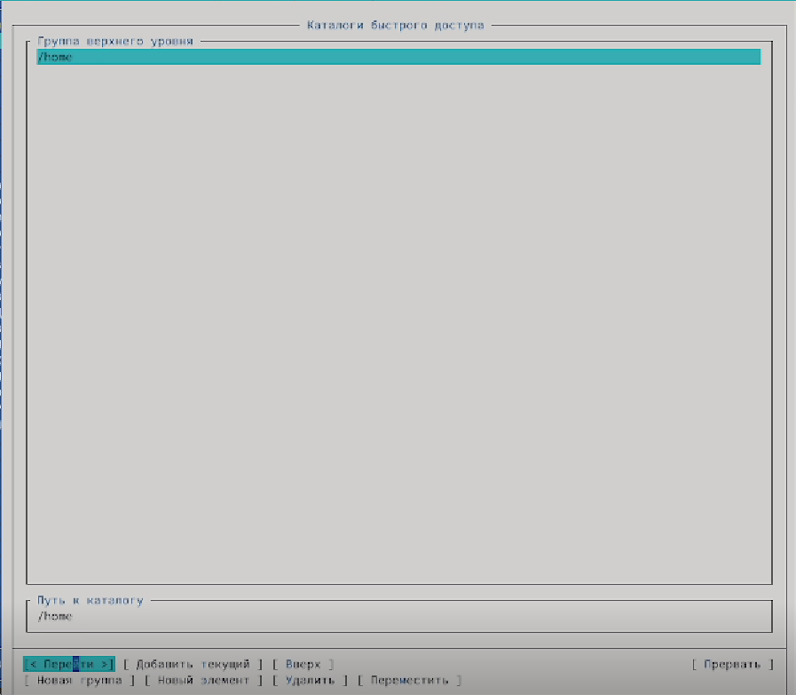
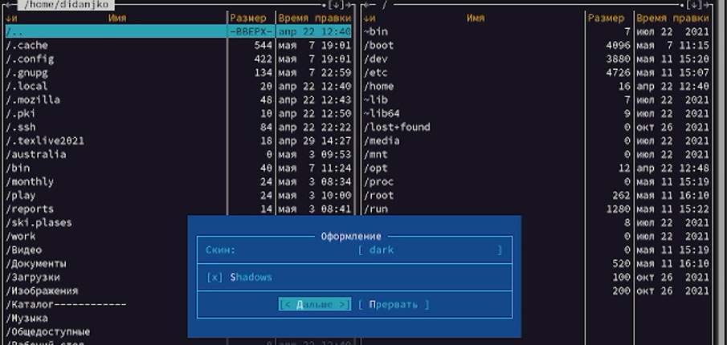
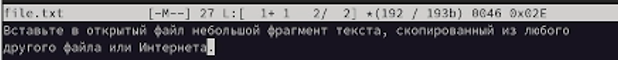
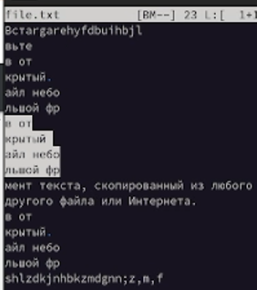

---
## Front matter
title: "Шаблон отчёта по лабораторной работе"
subtitle: "Простейший вариант"
author: "Дмитрий Сергеевич Кулябов"

## Generic otions
lang: ru-RU
toc-title: "Содержание"

## Bibliography
bibliography: bib/cite.bib
csl: pandoc/csl/gost-r-7-0-5-2008-numeric.csl

## Pdf output format
toc: true # Table of contents
toc-depth: 2
lof: true # List of figures
lot: true # List of tables
fontsize: 12pt
linestretch: 1.5
papersize: a4
documentclass: scrreprt
## I18n polyglossia
polyglossia-lang:
  name: russian
  options:
	- spelling=modern
	- babelshorthands=true
polyglossia-otherlangs:
  name: english
## I18n babel
babel-lang: russian
babel-otherlangs: english
## Fonts
mainfont: PT Serif
romanfont: PT Serif
sansfont: PT Sans
monofont: PT Mono
mainfontoptions: Ligatures=TeX
romanfontoptions: Ligatures=TeX
sansfontoptions: Ligatures=TeX,Scale=MatchLowercase
monofontoptions: Scale=MatchLowercase,Scale=0.9
## Biblatex
biblatex: true
biblio-style: "gost-numeric"
biblatexoptions:
  - parentracker=true
  - backend=biber
  - hyperref=auto
  - language=auto
  - autolang=other*
  - citestyle=gost-numeric
## Pandoc-crossref LaTeX customization
figureTitle: "Рис."
tableTitle: "Таблица"
listingTitle: "Листинг"
lofTitle: "Список иллюстраций"
lotTitle: "Список таблиц"
lolTitle: "Листинги"
## Misc options
indent: true
header-includes:
  - \usepackage{indentfirst}
  - \usepackage{float} # keep figures where there are in the text
  - \floatplacement{figure}{H} # keep figures where there are in the text
---

# Цель работы

Освоение основных возможностей командной оболочки Midnight Commander. Приобретение навыков практической работы по просмотру каталогов и файлов; манипуляций
с ними.

# Задание

Задание состорит в выполнении некоторых действий с mc редактором, направленных на улучшение понимания работы с последним.

# Теоретическое введение

Ссылка на [Github](https://github.com/DankoDmitry/study_2021-2022_os-intro)

# Выполнение лабораторной работы

 - (рис. 1)

{имоивиуи}

 - (рис. 2)

 - (рис. 3)

 - (рис. 4)

 - (рис. 5)

 - (рис. 6)

 - (рис. 7)

 - (рис. 8)

 - (рис. 9)

 - (рис. 10 и рис. 11 соответственно)

 - (рис. 12)

# Выводы

В ходе выполнения данной лабораторной работы научились работать с редактором mc.

# Контрольные вопросы

- Работа с системами хранения файлов и директорий, редактор самих файлов.
- Создавать, копировать, перемещать...
- Данная структура помагает легче работать с директориями и файлами.
- Данная вкладка настроена прямо на работу с выбранным файлом или директорией.
- Данная вкладка более всех похожа на командную строку, больше помогает переходить из папки в папку. 
- Позволяет настроить mc.
