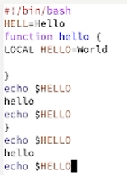
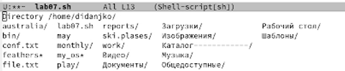
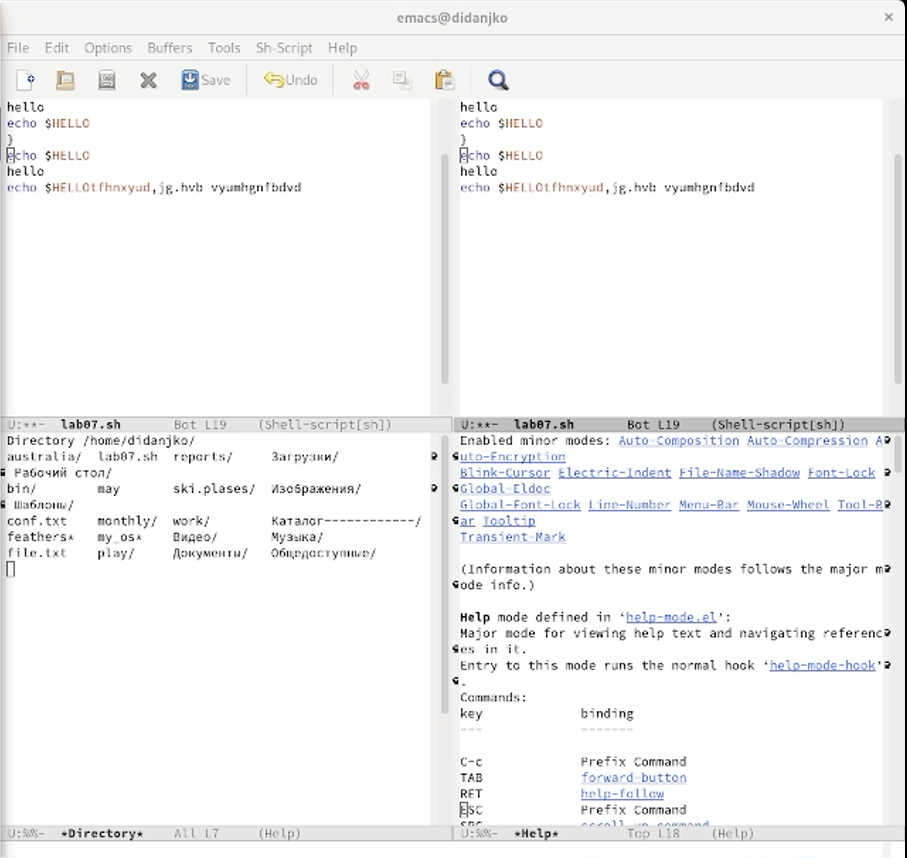
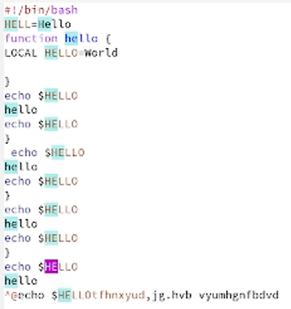

# Цель работы

Познакомиться с операционной системой Linux. Получить практические
навыки работы с редактором Emacs.

# Задание

Задание состорит в выполнении некоторых действий с редактоором emacs,
направленных на улучшение понимания работы с последним.

# Теоретическое введение

Ссылка на
[Github](https://github.com/DankoDmitry/study_2021-2022_os-intro)

# Выполнение лабораторной работы

# Выводы

В ходе выполнения данной лабораторной работы **научились** работать с
редактором emacs.
