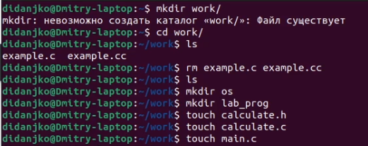
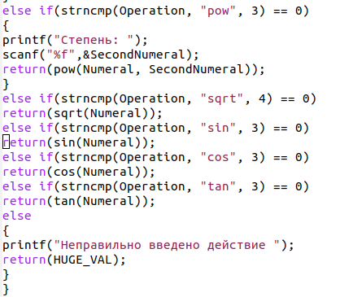
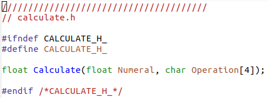
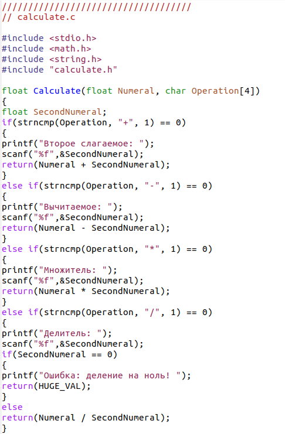
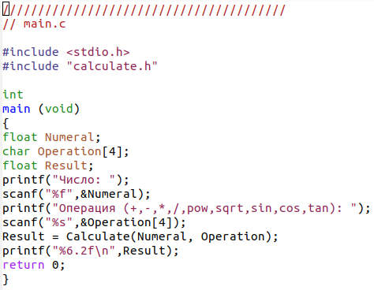
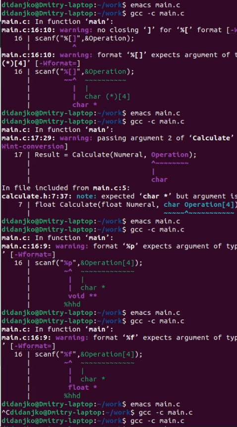
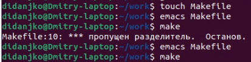
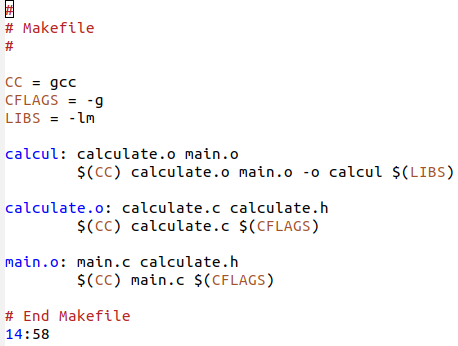
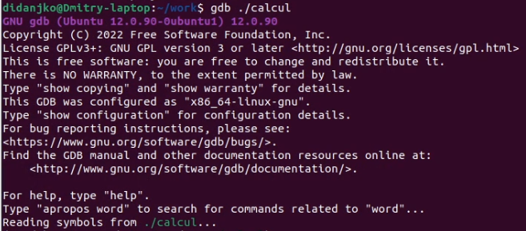

---
## Front matter
lang: ru-RU
title: Structural approach to the deep learning method
author: |
	Leonid A. Sevastianov\inst{1,3}
	\and
	Anton L. Sevastianov\inst{1}
	\and
	Edik A. Ayrjan\inst{2}
	\and
	Anna V. Korolkova\inst{1}
	\and
	Dmitry S. Kulyabov\inst{1,2}
	\and
	Imrikh Pokorny\inst{4}
institute: |
	\inst{1}RUDN University, Moscow, Russian Federation
	\and
	\inst{2}LIT JINR, Dubna, Russian Federation
	\and
	\inst{3}BLTP JINR, Dubna, Russian Federation
	\and
	\inst{4}Technical University of Košice, Košice, Slovakia
date: NEC--2019, 30 September -- 4 October, 2019 Budva, Montenegro

## Formatting
toc: false
slide_level: 2
theme: metropolis
header-includes: 
 - \metroset{progressbar=frametitle,sectionpage=progressbar,numbering=fraction}
 - '\makeatletter'
 - '\beamer@ignorenonframefalse'
 - '\makeatother'
aspectratio: 43
section-titles: true
---

# Цель работы

Цель данной лабораторной работы - приобретение простейших навыков разработки, анализа, тестирования и отладки приложений в ОС типа Linux на примере создания на языке программирования C калькулятора с простейшими функциями

# Выполнение лабораторной работы

{ #fig:01 width=70% }

{ #fig:02 width=70% }

{ #fig:03 width=70% }

{ #fig:04 width=70% }

{ #fig:05 width=70% }

{ #fig:06 width=70% }

{ #fig:07 width=70% }

{ #fig:08 width=70% }

{ #fig:08 width=70% }

{ #fig:009 width=70% }

# Выводы

В ходе данной лабораторной работы я приобрел навыки разработки, анализа, тестирования и отладки приложений в ОС на примере создания на языке программирования С калькулятора с простейшими функциями.

