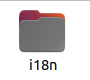
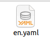
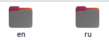
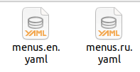
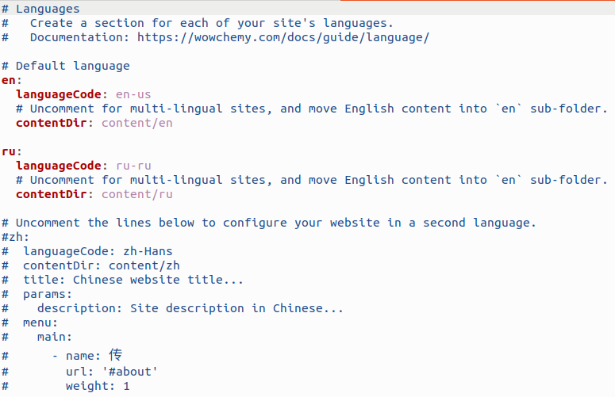
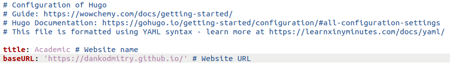
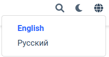
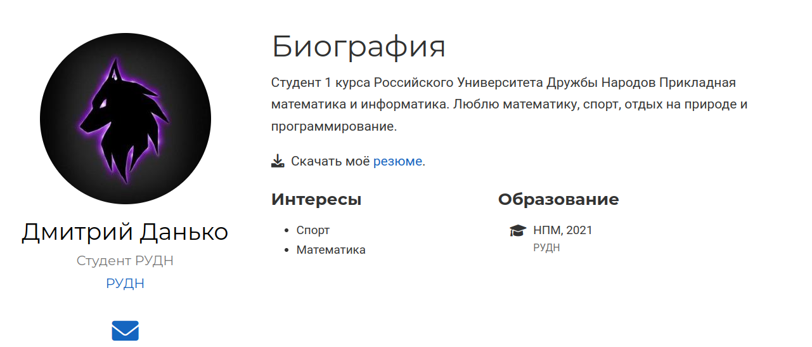
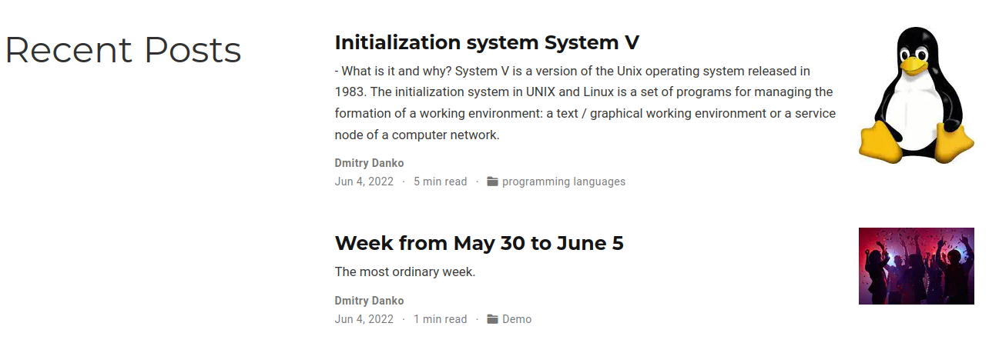
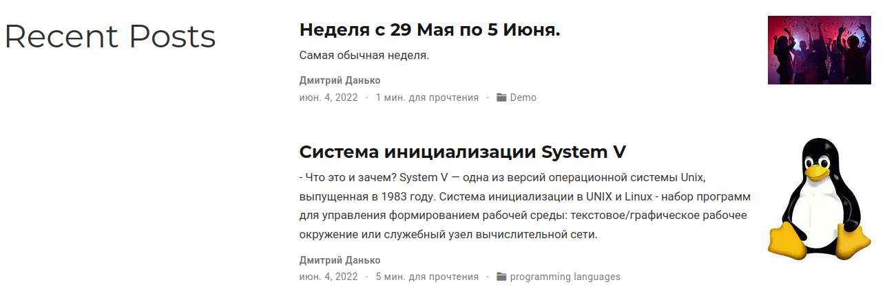

---
## Front matter
title: "Отчёт по 6 этапу индивидуального проекта"
subtitle: "НПМбд-01-21"
author: "Данько Дмитрий Игоревич"

## Generic otions
lang: ru-RU
toc-title: "Содержание"

## Bibliography
bibliography: bib/cite.bib
csl: pandoc/csl/gost-r-7-0-5-2008-numeric.csl

## Pdf output format
toc: true # Table of contents
toc-depth: 2
lof: true # List of figures
lot: true # List of tables
fontsize: 12pt
linestretch: 1.5
papersize: a4
documentclass: scrreprt
## I18n polyglossia
polyglossia-lang:
  name: russian
  options:
	- spelling=modern
	- babelshorthands=true
polyglossia-otherlangs:
  name: english
## I18n babel
babel-lang: russian
babel-otherlangs: english
## Fonts
mainfont: PT Serif
romanfont: PT Serif
sansfont: PT Sans
monofont: PT Mono
mainfontoptions: Ligatures=TeX
romanfontoptions: Ligatures=TeX
sansfontoptions: Ligatures=TeX,Scale=MatchLowercase
monofontoptions: Scale=MatchLowercase,Scale=0.9
## Biblatex
biblatex: true
biblio-style: "gost-numeric"
biblatexoptions:
  - parentracker=true
  - backend=biber
  - hyperref=auto
  - language=auto
  - autolang=other*
  - citestyle=gost-numeric
## Pandoc-crossref LaTeX customization
figureTitle: "Рис."
tableTitle: "Таблица"
listingTitle: "Листинг"
lofTitle: "Список иллюстраций"
lotTitle: "Список таблиц"
lolTitle: "Листинги"
## Misc options
indent: true
header-includes:
  - \usepackage{indentfirst}
  - \usepackage{float} # keep figures where there are in the text
  - \floatplacement{figure}{H} # keep figures where there are in the text
---

# Цель работы

Размещение двуязычного сайта на Github.

# Задание

 * Сделать поддержку английского и русского языков.
 
 * Разместить элементы сайта на обоих языках.
 
 * Разместить контент на обоих языках.
    
 * Сделать пост по прошедшей неделе.
    
 * Добавить пост на тему по выбору.

# Выполнение 6 этапа индивидуального проекта

1. Создаю папку i18n в blog. Загружаю файл английского языка в папку i18n, чтобы был путь вида i18n/en.yaml. (рис. [1] , [2])

{1}

{2}

2. Создаю в /blog/content 2 папки: en и ru. И копирую все файлы, которые содержались в content в эти папки (рис. [3]).

{3}

3. В /blog/config/_default изменяю файл languages.yaml и добавляю 2 файл menus, так же изменяю BaseURL странички (рис. [4] , [5], [0])

{4}

{5}

{5}

4. Размещаю элементы сайта на обоих языках (рис. [6])

{8}

5. Размещаю контент на обоих языках (рис.n[7], [8])

{7}

{8}

6. Добавляю 2 поста: пост по прошедшей неделе и пост на тему "Система инициализации Sys V". Для этого в папке post создаю 2 новые папки и изменяю файл index.md (рис. [9], [10])

{9}

{10}

# Выводы

Я научилась делать поддержку русского и английского языков

